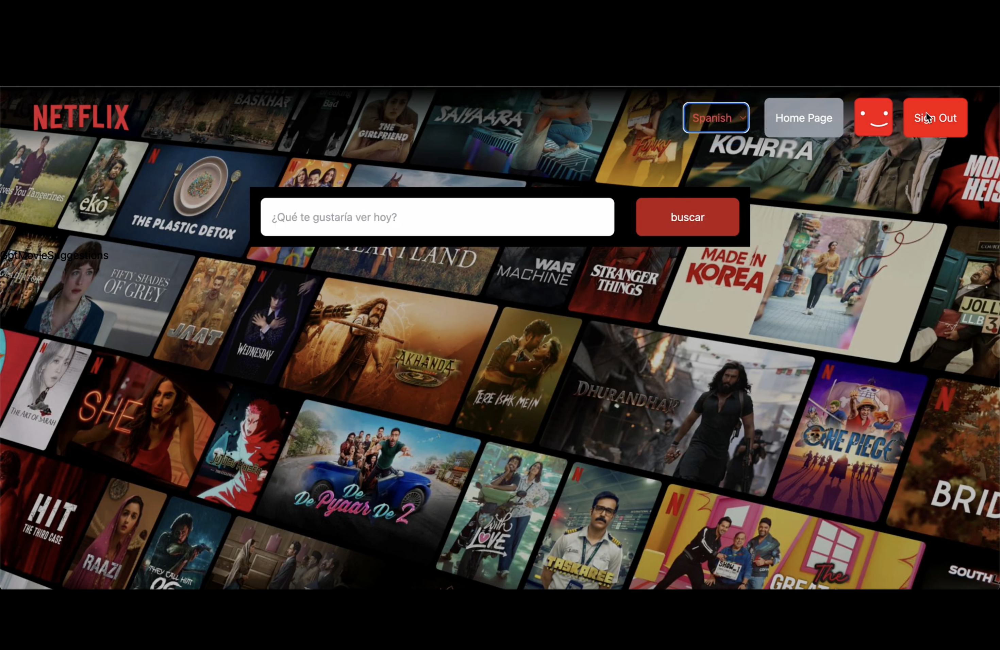

# NETFLIX- GPT
## 🎥 Click on the video to play

This project was bootstrapped with [Create React App](https://github.com/facebook/create-react-app).

## Features
- Build Sign In/ Sign Up UX 
- Tailwind Configuration
- Routing
- React forms
- Firebase configuration - Set up your own.env to add DB config
- Authentication using Firebase
- User Store and User Slice
- Update User Profile
- Register for OMDb api
- Embed Youtube Video with autoplay
- GPT Search Page
- GPT Search Bar
- Localization i18n

## Available Scripts

In the project directory, you can run:

### `npm start`

Runs the app in the development mode.\
Open [http://localhost:3000](http://localhost:3000) to view it in your browser.

The page will reload when you make changes.\
You may also see any lint errors in the console.

### `npm test`

Launches the test runner in the interactive watch mode.\
See the section about [running tests](https://facebook.github.io/create-react-app/docs/running-tests) for more information.

### `npm run build`

Builds the app for production to the `build` folder.\
It correctly bundles React in production mode and optimizes the build for the best performance.

The build is minified and the filenames include the hashes.\
Your app is ready to be deployed!
